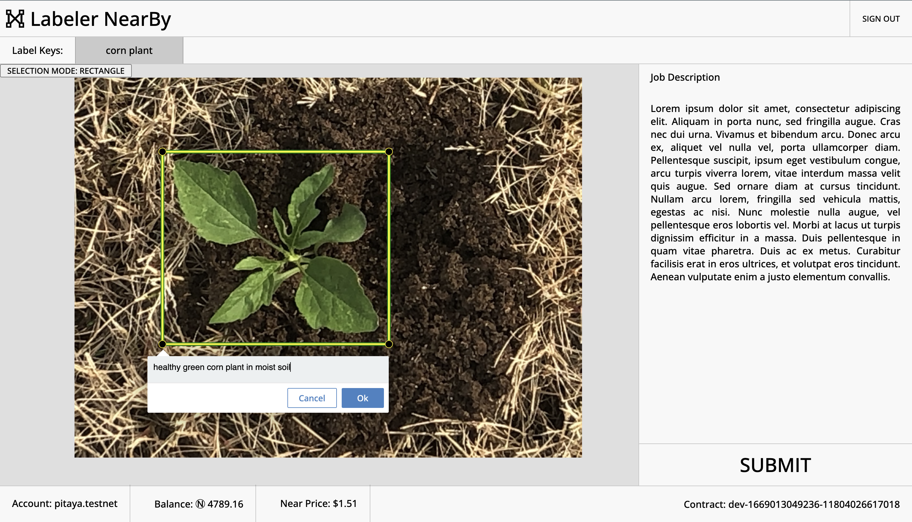

<h1 align="center">Labeler NearBy - Front End</h1>

    

---

## About Labeler NearBy:

Labeler NearBy is a web3 application created by me and @MehmetMHY for the 2022 NEAR MetaBUILD III hackathon. Labeler NearBy aims to provide a platform for AI researchers to connect directly with, and get their data labeled by, quality data labelers.

## About This Repository:

This repository contains the frontend code for Labeler NearBy. The frontend authenticates users using NEAR and provides an interface for labeling images. The backend can be found at [https://github.com/MehmetMHY/ln-researcher](https://github.com/MehmetMHY/ln-researcher)

## How to run locally (development server):

1. In your preferred directory, run `git clone https://github.com/dylan-eck/ln-labeler.git` to clone the repository.
2. In the `ln-labeler` folder, run `npm install` to install dependencies.
3. In the `ln-labeler` folder, run `npm run dev` to start the development server.
4. In a browser, open `localhost:3000` to use the web app.

## Usage:
Note: you need to have a NEAR testnet account to use this web app.

1. Upon opening the web app for the first time, you will be presented with the Labeler NearBy logo and a button to sign in using NEAR.
2. After signing in, the main dashboard will be displayed. In the cinter of the screen you will find a text input box with a prompt to enter the name of a smart contract account. Due to the unfinished nature of the web app, you may enter the name of any existing NEAR testnet account that has a smart contract deployed to it to proceed.
3. After entering a valid smart contract account name, you will be presented with the labeling interface.
4. To begin labeling, you first need to select a label key from the list immediately above the image. You can then hold shift and click and drag to on the image to select a region. Type of selection can be toggled by clicking the button in the top left corner of the image viewer.
